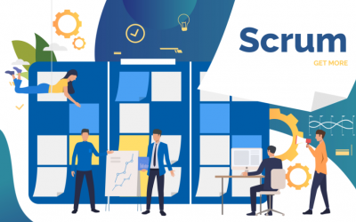
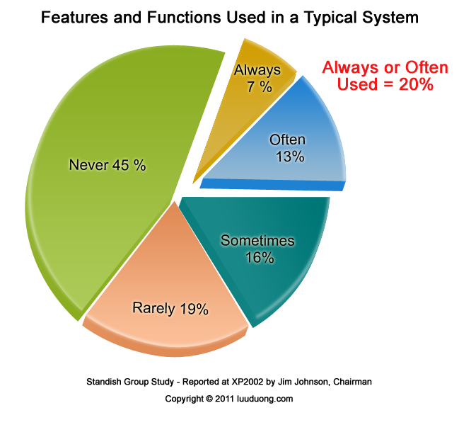
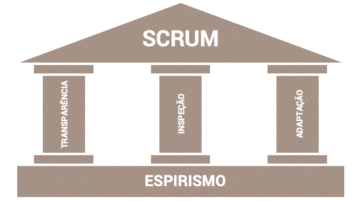
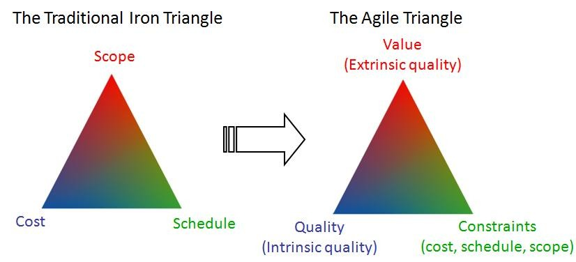
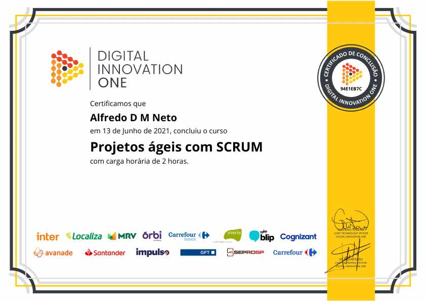

# Projetos Ágeis com SCRUM

## Desafios do Desenvolvimento de Software

1. Objectivos de Negócio
2. Processos de Desenvolvimento
	- Concepção
	- Análise & Design
	- Desenvolvimento
	- Testes
	- Implantação
3. Software

_(...) o Principio de Pareto também se aplica ao desenvolvimento de software, onde 20% das funcionalidades costumam gerar 80% ou mais de benefício esperado._

# Gestão de Projetos Tradicional x Ágil
- Waterfall (cascata): Apenas permite que o projeto avance quando uma fase está inteiramente completa
- Ágil: Software construído por partes (incremental) e cada parte executa-se em um ciclo (iterativo)

## Tabela de Comparação Tradicional VS Ágil

|Tradicional                                                      |Ágil                                                                         |
|-----------------------------------------------------------------|-----------------------------------------------------------------------------|
|1. Escopo definido na fase inicial do Projeto (preditivo)        |1. Escopo definido ao longo do projeto (adaptativo)                          |
|2. Projeto é controlado por fases e marcos                       |2. Projeto é controlado por funcionalidades entregues                        |
|3. Cliente só vê o software funcionando na fase final do Projeto |3. Cliente pode ver parte do software funcionando na parte inicial do projeto|
|4. Resistência a Mudanças                                        |4. Mudanças constantes de acordo com feedbacks contínuos                     |

Em projetos tradicionais (waterfall), você corre o risco de descobrir que estava errado depois de meses.Com o SCRUM, você descobre que estava errado em no máximo 30 dias.

## O que é ser àgil?

- Rapidez (mudança) e desembaraço
- Fazer coisas complexas de forma simples
- Equipe comprometida com os objetivos
- Maior valor para o cliente

*OBS: Agíl é diferente de Rápido. Ter capacidade de responder rapidamente a mudanças*

## SCRUM 
- SCRUM é um dos frameworks de gerenciamento de projetos ágeis
- Projeto usando equipes pequenas e multidisciplinares produzem os melhores resultados
- Pensado no jogo do Rugby

## PILARES DO SCRUM

- Conversar mais e escrever menos (Transparências)
- Demonstrar o software constantemente aos usuários e obter feedbacks constantes (Transparências)
- Requisitos mudam ao longo do tempo (Adaptação)
- Aprender progressivamente com o uso do software (Inspeção)

## Razões para adotar o SCRUM:
- Desenvolvido e entregue em partes menores (2 a 4 semanas), com constante feedback dos usuários
- Melhor gerenciamento de riscos (redução de incertezas)
- Comprometimento, motivado e transparência da equipe (Daily Meeting)
- Maior valor para o negócio (Priorização do Backlog)
- Usuário envolvidos durante todo o ciclo
- Aplicação das lições aprendidas (melhoria continua)

## Caracteristicas do time SCRUM
- Equipes capazes de se auto-organizarem
- As tarefas são do time e todos são responsaveis
- Forte comprometimento com os resultados

_POR QUE AS STARTUPS UTILIZAM FRAMEWORK ÁGIL?
_MVP - Minimum Viable Product
_EX: Ifood, Nu Bank 

## Parte 2: Papéis e Responsabilidades

1. PO - Product Owner
2. SM - Scrum Master
3. DEV - Time de Desenvolvimento (3 a 9 pessoas)

## Product Owner
- Representante da área de Negócios
- PO não é um Comitê
- Define as funcionalidades do software(Product Backlog)
- Prioriza as funcionalidades de acordo com o valor do negócio
- Garante que o time de desenvolvimento entenda os itens do Backlog no nível necessário

## Scrum Master
- Garantir o uso correto do SCRUM
- SCRUM MASTER não é gerente de projetos
- Age como facilitador
- Auxilia o Product Owner no planejamento e estimativas do backlog
- Auxilia a equipe a remover impedimentos
- Treina o time em autogerenciamento e interdiciplinaridade

## Time de Desevolvimento
- Possui habilidades suficientes para desenvolver, testar, criar e desenhar, ou seja, tudo que for necessário para entregar o software funcionando. 

## Parte 3: Cerimônias do SCRUM

Time Box = Tempo máximo para fazer uma cerimônia ou Sprint

Sprint = corrida, arrancada. É o principal evento do SCRUM.
Duração de 1 Sprint:
- 30 dias corridos ou menos

## SPRINT

Composição de uma sprint:
- Planejamento da Sprint
- Reuniões Diárias (Daily Meeting)
- Revisão da Sprint(Review)
- Retrospectiva da Sprint

## Quem participa? O Quê fazer? Como fazer? 

Time Box: 8horas

Planejamento da Sprint - Planning Poker

Reuniões Diárias - 15 minutos
KANBAN (To Do, Doing, Done)

Time DEV apresenta para o PO o trabalho feito
Time Box: 4horas (Sprint 30 dias)

Retrospectiva da Sprint
Reunião da equipe para lições aprendidas
Transparência
Time Box: 3horas (Sprint 30 dias)

## Parte 4: Gestão de Projetos Tradicionais x Ágil

Diferença prática
Gestão de Projetos Tradicional
Gestão de Projetos Ágil - responde mais rápido para o negócio

## Papéis e Responsabilidades - Product Owner
1. Papéis e Responsabilidades do Product Owner
2. Analisando escopo e definindo prioridades 
3. Papel do PO na transformação Digital

_O product Owner (PO) representa o profissional que tem a visão do que será desenvolvido, as necessidades a serem atendidas, o público que vai utilizar os serviços e os objetivos a serem alcançados._

## Release Planning
Liberação ou lançamento de software (em inglês: release) é o lançamento de nova versão oficial do produto de software. Cada vez que um produto de software é criado ou modificado, o fabricante e seus desenvolvedores decidem sobre como distribuir ou o novo produto ou a modificações às pessoas que o utilizam.

## Existem 2 tipos de Release Planing:
- Release Planning de Multiplas Squads
- Release Planning de Projeto

## Definindo Escopo e Prioridade

## Product Backlog
O produto backlog é composto por épicos e estórias:
1. épicos = incremento sem muito detalhamento, ajuda a te direcionar dos caminhos que deve seguir.
2. estória = Detalhamento dos épicos, um épico normalmente se divide em várias estórias, onde ficam descritos o que deve acontecer e suas regras de negócio. 

## Escrevendo uma Estória
- Nome da Estória
- Descrição da Estória(eu, como, quero, quando)
- Regras de Negócio (separar regras de front-end de Regras de Back-end)
- Tela (link ou imagem das telas a serem desenvolvidas)
- KPI (Quais  os objetivos/valor a estória precisa atingir)
- Tagueamento (como a estória será tagueada para poder mesuarar os KPI)
- Critérios de Aceite (Qual o passo a passo de todos os caminhos felizes possiveis a estória deve cumprir para que ela seja considerada aceita)

## Riscos
1. Positivos = Muitos ignorado nos projetos, porém um dos fatores de maiores ganhos no desenvolvimento de sistemas.
2. Negativos = itens que podem afetar o prazo, custo ou espaço de um projeto de maneira que pode acabar inviabilizando-o. 

## Papel do PO na transformação Digital
A transformação digital é um processo no qual as empresas fazem uso da tecnologia para melhorar o desempenho, aumentar o alcance e garantir resultados melhores. É uma mudança estrutural nas organizações dando um papel essencial para a tecnologia.

1. Estórias VS Tarefas
2. Critérios de aceite, estimativa e planejamento de tarefas
3. Relacionamento com clientes / Stakeholders

Épico
Estórias
Tarefas

## O que é um critério de aceite?
É uma lista de critérios que precisam ser alcançados para que a User Story atenda os requisitos do usuário e seja aceita pelo Product Owner.
Os critérios de aceitação têm o objetivo de: definir limites para as user stories. Ajudar o P.O a detalhar em alto nível o que é necessário para entregar valor ao cliente. 

## Cliente / Stackeholder

O stakeholder é uma pessoa ou um grupo que legitima as ações de uma organização e que tem um papel direto ou indireto na gestão e resultados dessa mesma organização. Desta forma, um stakeholder pode ser afetado positivamente ou negativamente, dependendo das suas políticas e forma de atuação. Alguns exemplos de stakeholder de uma empresa podem ser os seus funcionários, gestores, gerentes, proprietários, fornecedores, concorrentes, ONGs, cliente, o Estado, credores, sindictos e diversas outras pessoas ou empresas que estejam relacionadas com uma determinada ação ou projeto.

## Certificado

## Alfredo de Morais | Desenvolvedor de Aplicações Python
